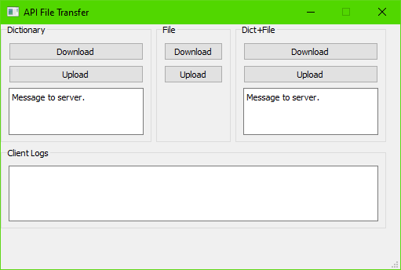

# APIs File Transfer with PyQt5

This is a playground repo aimed at providing a few ways to transfer files and contents between a client and a server:

- Client: gui implemented in `PyQt5` using `requests` library for the API calls;
- Server: a `flask` server implementing RESTful APIs.

What you will find in this repo:

- some useful guidelines for a reliable client-server application development;
- an easy-to-reuse `PyQt` application structure;
- simplified APIs for transferring information between a client and a server.

## Documentation

- <a href="./doc/00_overview.md">Overview</a>
- <a href="./doc/01_guidelines.md">Guidelines</a>
- <a href="./doc/02_snippets_python.md">Snippets `Python`</a>
- <a href="./doc/03_snippets_flask.md">Snippets `Flask`</a>
- <a href="./doc/04_snippets_pyqt5.md">Snippets `PyQt5`</a>